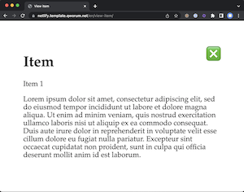

This is a template for a multi-language website that:

- uses [Qworum](https://qworum.net)'s advanced web browser capabilities, and
- is deployed to [Netlify](https://www.netlify.com).

## The "Hello World" Qworum application

This website implements a Qworum API that has 2 endpoints:

- the `home` endpoint, which is an application, and
- the `view-item` endpoint, called by `home`.

Here is the directory structure:

- Directories with 2-letter names such as `en` contain language-specific versions of the API endpoints.
- `assets` contains resources used by the web pages.
- All other directories (`home`, `view-item`) are the official endpoint paths; they are only used for redirecting API calls to language-specific endpoint versions.

Note that the API endpoint names mustn't be:

- 2 letters long,
- equal to `assets`.

## Deploy to Netlify

You can click on the button below for deployment. Alternatively, create your own GitHub repo from this template repo and, click on your own updated button.

## Verify that Qworum is activated for your website

Using Qworum's Netlify build plugin is recommended in order to ensure that your website will only be deployed if it is entitled to use Qworum.

[Add the Qworum plugin to your website's build process directly from Netlify's Integration Hub](https://app.netlify.com/plugins/@qworum/netlify-plugin-qworum/install).

## Activating Qworum for your website

__*Qworum must be activated for the DNS domain of your website, otherwise your website will not work as expected when deployed to Netlify.*__

A free plan is available for individuals. See the [Qworum plans and pricing](https://qworum.net/en/plans/).

## Live demo

Use this application live at [netlify.template.qworum.net](https://netlify.template.qworum.net).

See a video recording of this application:

## License

This software is released under the terms of the [Apache 2.0 license](https://www.apache.org/licenses/LICENSE-2.0).

∎
